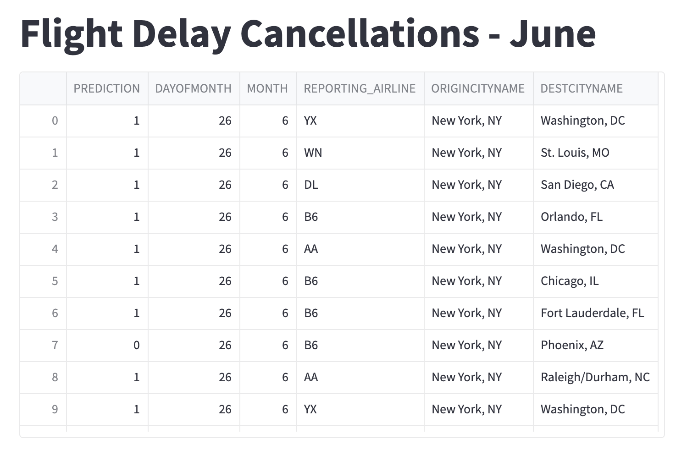
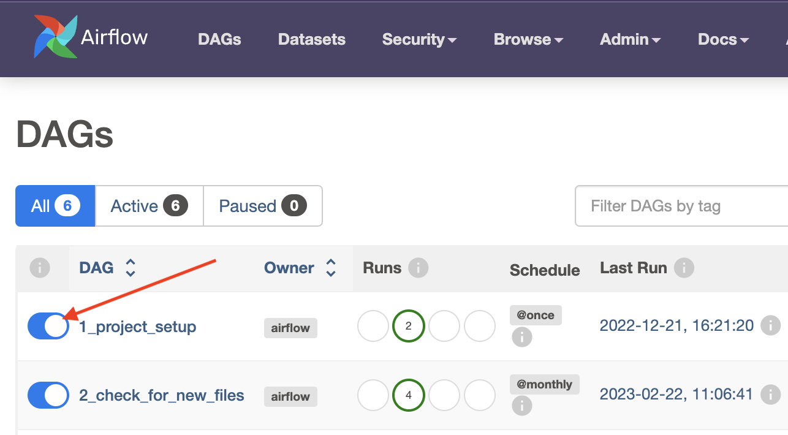
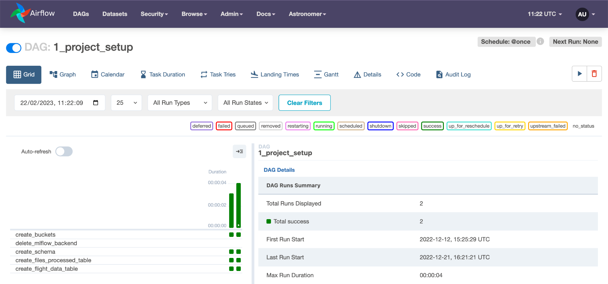
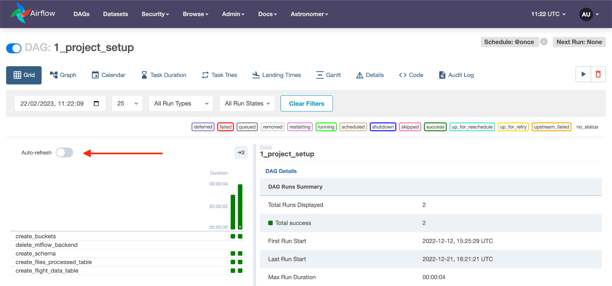
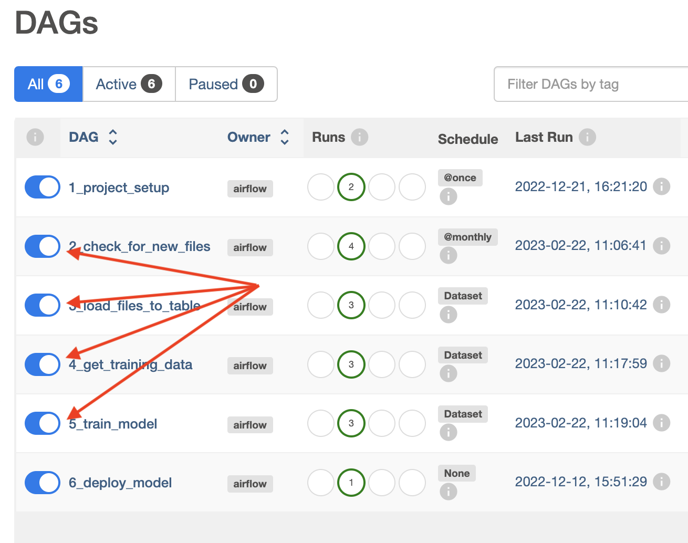
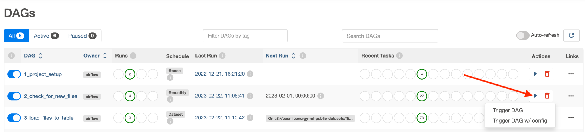
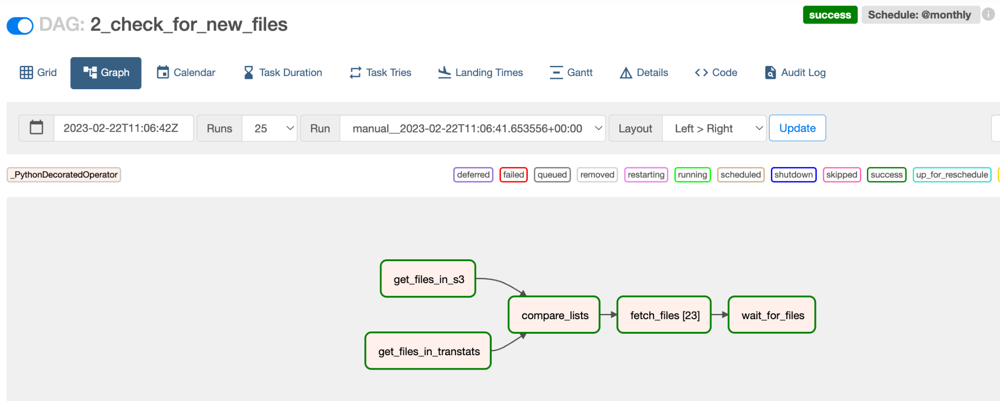
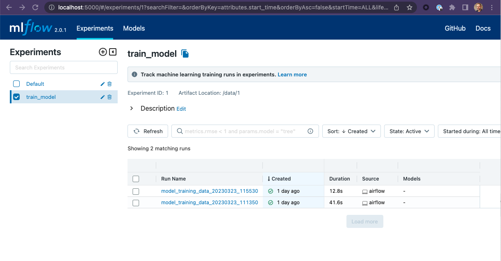
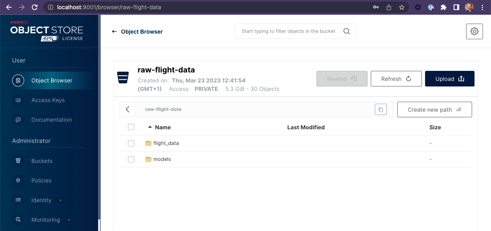

# Machine Learning Orchestration with Apache Airflow
## Build and manage a flight cancellation prediction application

This repo will build an end-to-end machine learning application that trains a model that can predict if a flight will be cancelled. The various workflows are managed by Apache Airflow running in a local instance, powered by Astronomer's [astro cli](https://docs.astronomer.io/astro/cli/overview). 

The final result is a Streamlit Application that can make a cancellation prediction for on a randomly selected flight.

There are 2 specific prerequisites you need to run this repo:
1. A Docker Engine. [Docker Desktop](https://www.docker.com) or [Colima](https://github.com/abiosoft/colima) both work with the Astro CLI.
2. The [Astro CLI](https://docs.astronomer.io/astro/cli/overview)

Here are the steps to follow to get this project running:
1. ### Clone the workshop repo to your local machine.  
   `$ git clone https://github.com/fletchjeff/airflow-flight-demo`

2. ### Start up the local astro services.  
    `$ cd airflow-flight-demo`  
    `$ astro dev start`

3. ### Run the Project Setup DAG  
    Run The the project setup DAG to configure the [minio](https://min.io/) buckets and the Postgres schema and tables. Open the Airflow UI at http://localhost:8080/  

    User: `admin`  
    Password: `admin`

    You should see 6 DAGs in the DAGs list, including `1_project_setup`. Activate the `1_project_setup` DAG but clicking the slider next to the name.

    

    The `1_project_setup` DAG only needs to be run once and will configure everything you need for the project. Once it’s complete, if you click on the `1_project_setup` name in the DAG list, you should see the following in the grid view.

    

    If its still running, enabling the Auto-refresh with the slider in the grid view will update the grid as the DAG completes the various tasks.

    

4. ### Run the DAGs  
    In the Airflow UI, you should see a DAG called `2_check_for_new_files`. Make it and all the other DAGs active by clicking the slider next to its name:

    

    Click the play button next to the 2_check_for_new_files DAG's name to trigger the DAG run:

    
    
    Click the DAG's name and then the Graph icon to see how it ran in the Graph view:

    

5. ### View MLFlow and Minio UIs
   You can view the model training run details created by this code by connecting to the local MLFlow UI created when astro launches.

   Open the MLFlow us at http://localhost:5000/

   

    You can also view the files created for this tutorial by connecting to the local Minio console created when astro launches. 

    Open the Minio console at http://localhost:9001/login  
    User: `minioadmin`  
    Password: `minioadmin`

   

6. ### View the Streamlit App  
   The final step is to view the Streamlit App. You can view the app at http://localhost:8501/

   

